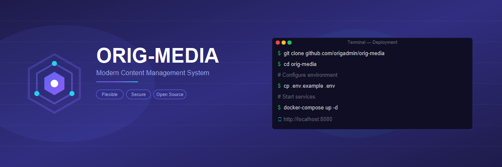

<p align="center">

  
  <h1 align="center">OrigMedia</h1>
  <p align="center">
    <strong>高性能开源媒体内容管理系统</strong>
  </p>
  <p align="center">
    Go + Gin · React SPA · REST API · 视频转码 · HLS 自适应流
  </p>

---

OrigMedia 是一个面向现代 Web 平台的开源视频和媒体内容管理系统（CMS）。它为视频托管、点播、直播提供了完整的解决方案，适用于教育机构、企业内网、社区门户等场景。

## 特性

- **Go + Gin 框架** — 轻量级高性能 Web 框架，低内存占用，单机可承载数千并发
- **HLS 自适应流播放** — 自动多分辨率转码，根据带宽无缝切换画质
- **多种媒体类型** — 支持视频、音频、图片、PDF
- **灵活的发布流程** — 公开、私密、不列出的多种可见性控制
- **RBAC 角色权限** — 细粒度的用户组与权限管理
- **分类与标签体系** — 多维度媒体组织方式
- **播放列表** — 视频/音频内容的有序整理与分享
- **评论与互动** — 点赞、收藏、评论系统
- **响应式设计** — 适配桌面和移动端，支持亮色/暗色主题
- **i18n 国际化** — 内置多语言支持框架
- **REST API** — 完整的 API 接口，便于集成和二次开发
- **JWT 认证** — 安全的令牌认证机制

## 与同类项目的对比

| 特性 | OrigMedia | 某主流 Python CMS | 某主流 Go CMS | 某主流 Node.js CMS |
|------|---------|-------------------|---------------|-------------------|
| **后端语言** | Go | Python | Go | JavaScript |
| **架构模式** | 单体 (Gin) | 单体 | 单体 | 单体 |
| **API 协议** | REST API | REST only | REST only | REST + GraphQL |
| **视频转码** | FFmpeg + HLS | FFmpeg + HLS | 无内置 | 第三方插件 |
| **部署复杂度** | 单体/微服务可切换 | 中等 | 简单 | 简单 |
| **内存占用** | ~30MB (空闲) | ~150MB | ~50MB | ~120MB |
| **并发性能** | 优秀 (goroutine) | 一般 (线程/协程) | 优秀 | 良好 |
| **前端技术** | React + shadcn/ui | React | 模板渲染 | React |
| **i18n** | 内置支持 | 部分支持 | 无 | 插件 |
| **RBAC** | 内置 | 内置 | 插件 | 插件 |

> OrigMedia 的核心优势在于 Go 语言带来的性能红利和 Gin 框架的简洁高效。单体架构适合快速部署和中小规模使用。

## 使用场景

- **教育培训** — 学校、在线教育平台托管课程视频，学生可以流畅观看或下载
- **企业内网** — 内部培训、产品演示、会议录像的安全托管
- **社区门户** — 搭建定制化的视频社区，完全掌控数据和用户体验
- **个人媒体库** — 组织、分类、托管个人内容

## 技术栈

| 层次 | 技术 |
|------|------|
| 后端 | Go 1.21+ / Gin |
| ORM | ent v0.14.6 |
| 数据库 | PostgreSQL |
| 消息总线 | Watermill (Pub/Sub) |
| 服务发现 | Consul |
| API 协议 | HTTP REST |
| 依赖注入 | 无 (Gin 轻量无 DI) |
| 前端 | React 18 + TypeScript + shadcn/ui |
| 构建工具 | Rsbuild |
| 视频转码 | FFmpeg + HLS |
| 容器化 | Docker |

## 快速开始

### 环境要求

- Go 1.21+
- Node.js 18+ (或 Bun)
- PostgreSQL 15+
- FFmpeg (视频转码功能需要)

### 从源码构建

```bash
# 克隆项目
git clone https://github.com/origadmin/orig-media.git
cd orig-media

# 安装开发工具 (buf, wire, protoc-gen-go 等)
make init

# 生成代码 (protobuf, ent, wire)
make generate

# 单体模式启动 (开发推荐)
go run ./cmd/server/...

# 启动前端
cd web && npm install && npm run dev
```

### 使用 Docker

```bash
# 构建镜像
make build-docker-svc-api-gateway

# 或使用 docker-compose (待完善)
# docker compose up -d
```

### 配置

配置文件位于 `configs/` 目录下，支持 YAML 格式：

```yaml
# configs/server.yaml 示例
server:
  http:
    addr: 0.0.0.0:8080
  grpc:
    addr: 0.0.0.0:9000

database:
  driver: postgres
  source: "host=localhost port=5432 user=postgres dbname=origmedia sslmode=disable"
```

## 项目结构

```
orig-media/
├── api/proto/v1/          # Protobuf API 定义
│   ├── media/             # 媒体服务接口
│   ├── user/              # 用户服务接口
│   ├── portal/            # 门户聚合接口
│   └── types/             # 共享类型定义
├── cmd/
│   ├── server/            # 单体模式入口 (开发/小规模部署)
│   ├── svc-user/          # 用户微服务
│   ├── svc-media/         # 媒体微服务
│   ├── svc-content/       # 内容微服务 (评论/通知/收藏)
│   └── svc-api-gateway/   # API 网关
├── configs/               # 配置文件
├── internal/
│   ├── data/entity/       # Ent ORM Schema (13 个实体)
│   ├── server/            # HTTP/gRPC 路由注册
│   ├── svc-user/          # 用户服务实现 (biz/service/data)
│   ├── svc-media/         # 媒体服务实现
│   └── helpers/           # 公共工具 (配置/日志/中间件)
├── web/                   # React 前端
│   └── src/
│       ├── pages/         # 页面组件
│       ├── components/    # UI 组件 (shadcn/ui)
│       └── lib/           # 工具函数与 API 封装
└── docs/                  # 项目文档
```

## 文档

| 文档 | 说明 |
|------|------|
| [架构设计](docs/ARCHITECTURE.md) | 系统架构、服务边界、数据流 |
| [开发者文档](docs/DEVELOPMENT.md) | 开发环境搭建、代码规范、API 开发 |
| [管理员文档](docs/ADMIN.md) | 系统配置、用户管理、运维指南 |
| [视频转码](docs/TRANSCODE.md) | FFmpeg 配置、转码流程、监控 |

## 硬件建议

| 规模 | CPU | 内存 | 存储 | 说明 |
|------|-----|------|------|------|
| 小型 (测试/个人) | 1-2 核 | 2GB | 50GB | 日均上传 < 1h 视频 |
| 中型 (团队/学校) | 4 核 | 8GB | 500GB | 日均上传 < 10h 视频 |
| 大型 (平台/企业) | 8+ 核 | 16GB+ | 2TB+ | 需考虑对象存储和分布式部署 |

> 存储空间建议：原始视频 + 转码版本 + HLS 分片 ≈ 原始视频大小的 3 倍

## 参与贡献

欢迎各种形式的贡献：

- 提交 Issue 反馈问题或建议
- 提交 PR 修复 Bug 或开发新功能
- 完善 i18n 多语言翻译
- 编写文档和教程
- Star 本项目让更多人看到

## License

本项目基于 [GNU AGPL v3.0](LICENSE) 开源。
